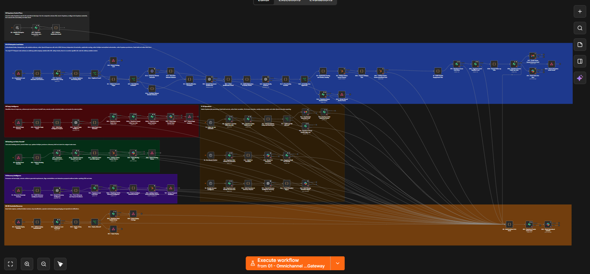
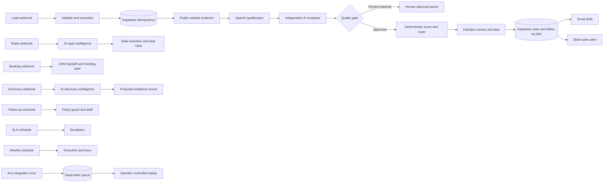

# n8n AI Revenue Operations Automation

[](https://github.com/gaboscini/n8n-ai-revenue-operations-automation/actions/workflows/validate.yml)
[](LICENSE)

An end-to-end AI Revenue Operations control plane built in n8n. It connects lead intake, AI qualification, CRM orchestration, human-reviewed outreach, reply and discovery intelligence, SLA monitoring, executive reporting, and controlled failure recovery in one workflow.

This is not a basic form-to-email automation. It demonstrates how an AI-assisted business process can preserve state, apply deterministic controls, coordinate multiple SaaS platforms, and keep customer-facing decisions under human supervision.

## The business outcome

Revenue teams often manage leads across disconnected forms, spreadsheets, inboxes, CRM records, meeting tools, and follow-up queues. That fragmentation causes duplicate records, slow response times, inconsistent qualification, missed follow-ups, and poor visibility into pipeline risk.

This workflow creates a shared operating layer that:

- accepts and validates new B2B leads;
- prevents duplicate processing through idempotency checks;
- researches the prospect's public website safely;
- uses OpenAI to structure qualification evidence;
- runs an independent AI quality review before scoring;
- applies deterministic lead scoring, routing, ownership, and SLA rules;
- creates or updates HubSpot contacts and deals;
- stores operational state and audit events in Supabase;
- creates Gmail drafts for human approval;
- alerts sales and operations teams in Slack;
- reacts to replies, bookings, and discovery-call transcripts;
- stops follow-up when consent or engagement state changes;
- monitors priority-lead SLAs and produces weekly summaries;
- captures failed operations in a dead-letter queue for controlled recovery.

## Workflow overview



The canvas contains 99 nodes organized into seven documented modules. It uses native n8n nodes for Supabase, OpenAI, HubSpot, Gmail, and Slack. The single HTTP Request node is intentionally limited to retrieving a prospect's public website after URL safety checks.

## End-to-end process



## Technology and integrations

| Platform | Role in the workflow |
| --- | --- |
| n8n | Orchestration, triggers, schedules, branching, and operational control |
| OpenAI | Structured lead qualification, quality evaluation, reply classification, discovery analysis, and weekly narrative |
| Supabase | Lead state, idempotency, follow-up jobs, approvals, audit events, AI evidence, tenant configuration, and dead letters |
| HubSpot | Contact upsert, associated deal creation, pipeline updates, and discovery records |
| Gmail | Human-reviewed lead and follow-up drafts |
| Slack | Priority-lead, handoff, SLA, report, and incident notifications |

## AI with deterministic safeguards

AI is used for interpretation, not unrestricted execution.

| AI operation | Output | Control applied afterward |
| --- | --- | --- |
| Lead qualification | Requirements, impact, urgency, risks, missing information, and evidence | Strict JSON Schema and independent evaluation |
| Quality evaluation | Unsupported claims, contradictions, injection risk, and corrections | Rejected results enter human review |
| Reply intelligence | Intent, sentiment, facts, objections, and stop recommendation | Fixed state-transition map controls the next state |
| Discovery intelligence | Objectives, requirements, constraints, risks, decisions, and proposal blockers | Human-owned proposal readiness and CRM update |
| Weekly revenue summary | Observations, risks, and recommended investigations | Based only on calculated operational metrics |

Deterministic Code nodes—not the language model—control lead score, tier, owner, SLA, state transitions, follow-up eligibility, retry limits, and replay authorization.

## Tested workflow

The current release has been imported and tested as a complete portfolio implementation using non-production configuration and synthetic business data. The tested flow covers the primary lead journey from intake through AI qualification, Supabase persistence, HubSpot orchestration, Gmail draft creation, Slack notification, engagement-state changes, reporting, and recovery handling.

Credentials and account-specific identifiers are intentionally excluded from Git. After importing the workflow, each user must connect their own accounts and map their own HubSpot pipeline, Slack channel, Gmail mailbox, booking link, and Supabase project before running the test scenarios.

## Repository structure

```text
.
|-- workflows/
|   `-- revops-ai-enterprise-control-plane.json
|-- supabase/
|   `-- schema.sql
|-- docs/
|   |-- assets/workflow-overview.png
|   |-- ARCHITECTURE.md
|   |-- DEMO_GUIDE.md
|   |-- SETUP.md
|   `-- TESTING.md
|-- scripts/
|   `-- validate-workflow.mjs
|-- .github/workflows/validate.yml
|-- SECURITY.md
|-- LICENSE
`-- package.json
```

## Installation and configuration

### 1. Prerequisites

Prepare the following before importing the workflow:

- n8n 1.117.0 or later;
- a Supabase project;
- an OpenAI API account with access to the configured model;
- a HubSpot account with permission to manage contacts and deals;
- a Gmail account for draft creation;
- a Slack workspace and destination channel;
- Node.js 20 or later if you want to run the repository validator.

Use test or non-production accounts while configuring the project for the first time.

### 2. Clone the repository

```bash
git clone https://github.com/gaboscini/n8n-ai-revenue-operations-automation.git
cd n8n-ai-revenue-operations-automation
```

### 3. Create the Supabase data model

1. Open the SQL Editor in your Supabase project.
2. Copy and run [`supabase/schema.sql`](supabase/schema.sql).
3. Confirm that these tables exist:
   - `revops_tenant_config`
   - `revops_lead_state`
   - `revops_event_log`
   - `revops_followup_jobs`
   - `revops_approvals`
   - `revops_ai_runs`
   - `revops_dlq`
4. Confirm row-level security is enabled.
5. Create an n8n Supabase credential with only the access required by the workflow.

### 4. Import the n8n workflow

1. In n8n, select **Workflows → Import from File**.
2. Choose [`workflows/revops-ai-enterprise-control-plane.json`](workflows/revops-ai-enterprise-control-plane.json).
3. Open the imported workflow named **RevenueOps AI Enterprise - Supabase All-in-One Control Plane**.
4. Keep the workflow inactive until credentials and account-specific values are configured.

### 5. Connect credentials

Open each native integration node and select the appropriate n8n credential:

| Credential | Nodes to configure | Minimum purpose |
| --- | --- | --- |
| Supabase | All Supabase nodes | Read and write the seven `revops_*` tables |
| OpenAI | Five OpenAI nodes | Run structured Responses API operations |
| HubSpot | Contact, deal, update, and discovery nodes | Manage demonstration contacts and deals |
| Gmail | Initial and scheduled draft nodes | Create drafts in the selected mailbox |
| Slack | Sales, handoff, SLA, report, and incident nodes | Post messages to the selected channel |

Do not paste credentials into the workflow JSON or commit them to Git.

### 6. Replace account-specific values

Review these values before execution:

- replace `https://example.com/replace-booking-link` with your scheduling link;
- confirm the OpenAI model available in your account;
- confirm HubSpot uses the expected `default` pipeline;
- map the `appointmentscheduled` and `qualifiedtobuy` deal stages, or replace them with your portal's internal stage IDs;
- select the correct Gmail mailbox;
- select the correct Slack workspace and test channel;
- confirm the schedules and timezone match your operating hours.

### 7. Verify the Supabase connection

Run the manual **00.1 - Supabase Connectivity and Schema Check** branch. Confirm the workflow can reach all seven tables before testing any webhook flow.

## How to use the workflow

n8n provides two webhook URL modes:

- use `/webhook-test/` while executing a trigger manually in the editor;
- use `/webhook/` after the workflow has been activated.

Replace `https://YOUR-N8N-DOMAIN` in the examples below with your n8n base URL.

### Submit a new lead

Endpoint: `POST /webhook/revops-enterprise-lead`

```json
{
  "source": "website",
  "firstName": "Avery",
  "lastName": "Morgan",
  "email": "avery@example.com",
  "phone": "+15550102030",
  "company": "Northstar Operations",
  "website": "https://example.com",
  "region": "APAC",
  "message": "We need to automate lead qualification, CRM updates, follow-up, and sales handoff across our revenue team.",
  "consentToContact": true
}
```

The lead branch validates the request, checks idempotency, gathers allowed website evidence, performs qualification and quality review, scores the lead, updates HubSpot, stores state in Supabase, creates follow-up jobs and a Gmail draft, and posts the appropriate Slack alert.

### Process an inbound reply

Endpoint: `POST /webhook/revops-enterprise-reply`

```json
{
  "leadId": "LEAD_UUID_FROM_SUPABASE",
  "correlationId": "CORRELATION_ID_FROM_INTAKE",
  "sender": "avery@example.com",
  "subject": "Re: automation discovery",
  "message": "We are interested. Please schedule a discovery call next week."
}
```

The workflow classifies the reply, chooses the deterministic next state, cancels follow-up when required, records the decision, and alerts the responsible team.

### Record a meeting booking

Endpoint: `POST /webhook/revops-enterprise-booking`

```json
{
  "leadId": "LEAD_UUID_FROM_SUPABASE",
  "correlationId": "CORRELATION_ID_FROM_INTAKE",
  "bookingId": "booking-1001",
  "startTime": "2026-10-15T02:00:00.000Z",
  "attendeeEmail": "avery@example.com",
  "status": "booked"
}
```

This branch moves the lead to the booked state, cancels outstanding follow-up jobs, updates the HubSpot deal, prepares a sales brief, and posts a meeting handoff in Slack.

### Submit a discovery transcript

Endpoint: `POST /webhook/revops-enterprise-discovery`

```json
{
  "leadId": "LEAD_UUID_FROM_SUPABASE",
  "correlationId": "CORRELATION_ID_FROM_INTAKE",
  "transcript": "A discovery transcript of at least 100 characters containing the customer's confirmed objectives, current process, integration requirements, constraints, stakeholders, risks, decisions, and open questions."
}
```

The workflow extracts structured discovery intelligence, identifies contradictions and proposal blockers, stores the evidence in Supabase, and creates the corresponding HubSpot record.

### Request controlled dead-letter recovery

Endpoint: `POST /webhook/revops-enterprise-replay`

```json
{
  "dlqId": "DLQ_UUID_FROM_SUPABASE",
  "confirmed": true
}
```

The replay branch checks the stored event and retry limit, then returns a sanitized replay package for operator review. It does not silently rerun a failed customer-facing action.

## Recommended test sequence

Run each branch with synthetic records before activating the complete workflow:

1. Execute the Supabase connectivity check.
2. Submit a valid lead and confirm Supabase, OpenAI, HubSpot, Gmail, and Slack results.
3. Submit the same lead again and confirm duplicate handling.
4. Exercise an AI-quality rejection and inspect the manual approval record.
5. Submit interested, unsubscribe, and complaint replies and verify their different stop rules.
6. Submit a booking and confirm the CRM stage and follow-up cancellation.
7. Submit a discovery transcript and inspect the structured intelligence.
8. Run the follow-up, SLA-monitor, and weekly-report schedule branches manually.
9. Trigger a controlled integration failure and inspect the dead-letter record and replay package.
10. Review all Gmail drafts, Slack destinations, CRM records, and audit events before activation.

## Operating model

### Scheduled automation

- Follow-up jobs are loaded, claimed, checked against current consent and state, and converted into Gmail drafts.
- Priority leads are monitored for SLA breaches and escalated to Slack with an audit event.
- Weekly revenue metrics are calculated from stored state and summarized by OpenAI for leadership review.

### Human checkpoints

- Failed AI quality reviews enter an approval queue.
- Gmail nodes create drafts instead of sending messages automatically.
- Discovery results expose proposal blockers rather than creating commitments.
- Dead-letter replay requires an explicit operator decision.

### Failure handling

Integration errors are sanitized and stored in `revops_dlq`. Slack receives an operational alert, retry attempts are bounded, and the replay endpoint prepares a reviewed recovery package. This keeps failure recovery visible and auditable.

## Security considerations

- Store credentials only in n8n's credential manager.
- Protect all public webhook endpoints with authentication, authorization, rate limiting, and replay protection appropriate to your environment.
- Use least-privilege Supabase, HubSpot, Gmail, and Slack access.
- Keep row-level security enabled and define policies for your tenant model.
- Review data retention for lead payloads, transcripts, AI outputs, audit records, and dead letters.
- Validate recipients and consent before approving Gmail drafts.
- Never use real customer data while adapting or demonstrating the project.

See [`SECURITY.md`](SECURITY.md) for vulnerability reporting and deployment guidance.

## Local repository checks

```powershell
npm.cmd test
```

The included validator checks the workflow export, node connections, Code-node syntax, native integration coverage, Supabase schema, credential exclusion, public-safe placeholders, workflow layout, and screenshot artifact. GitHub Actions runs the same check for every push and pull request.

## Documentation

- [Architecture and module design](docs/ARCHITECTURE.md)
- [Detailed setup guide](docs/SETUP.md)
- [Demonstration walkthrough](docs/DEMO_GUIDE.md)
- [Testing guide](docs/TESTING.md)
- [Security policy](SECURITY.md)

## Author

**gaboscini**  
AI automation, cloud solution design, and enterprise workflow engineering

## License

Released under the [MIT License](LICENSE).
